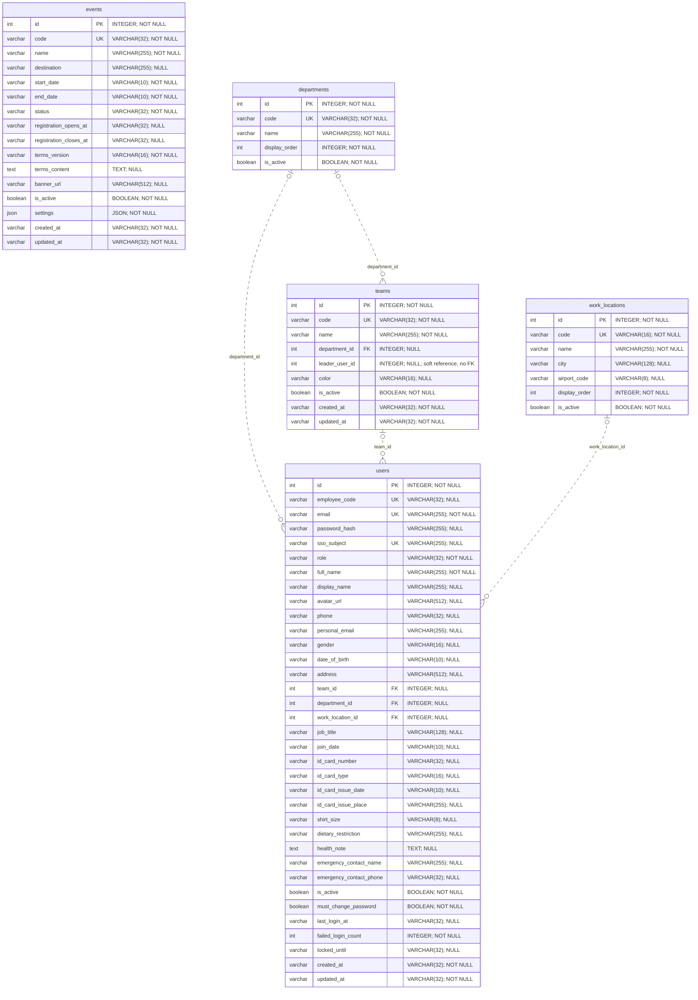
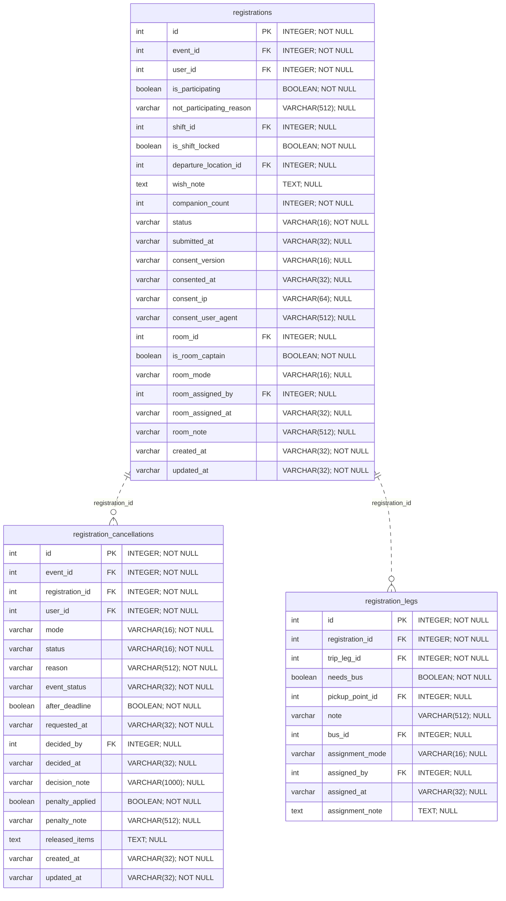
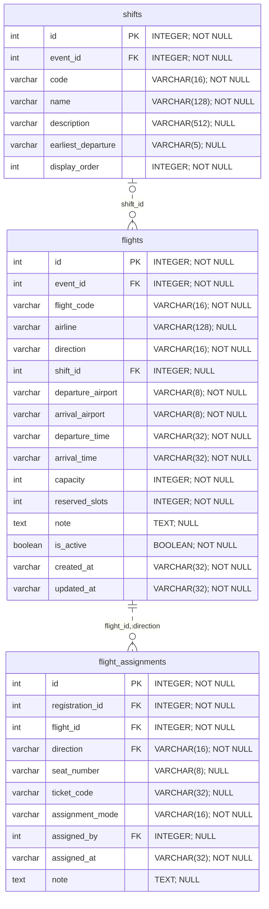
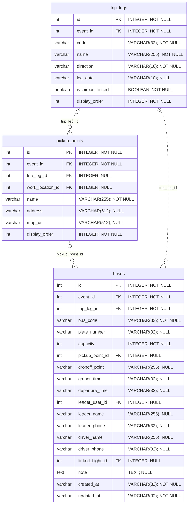
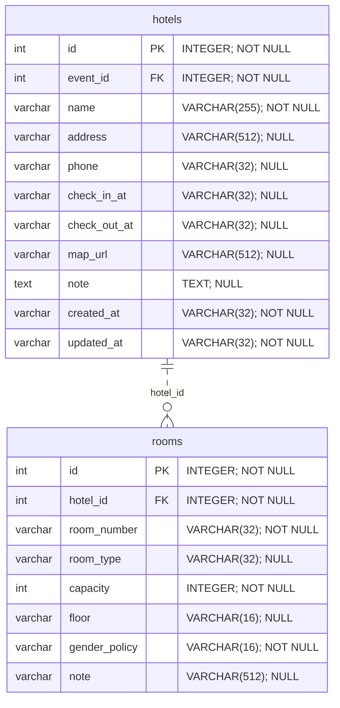
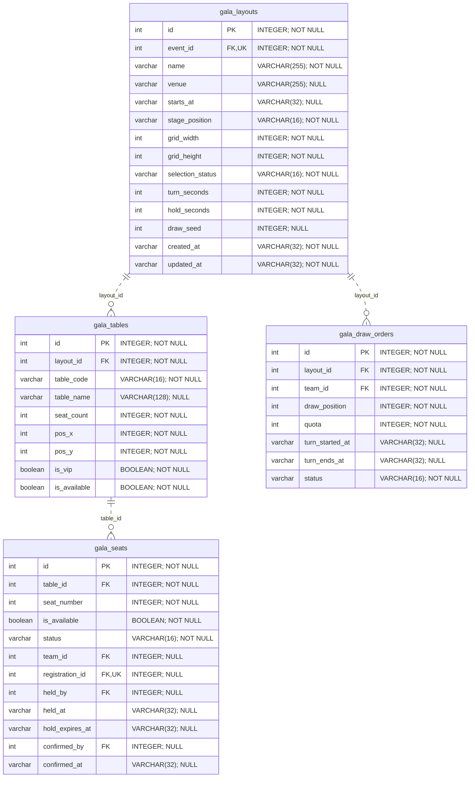
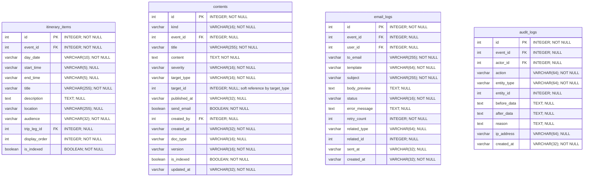
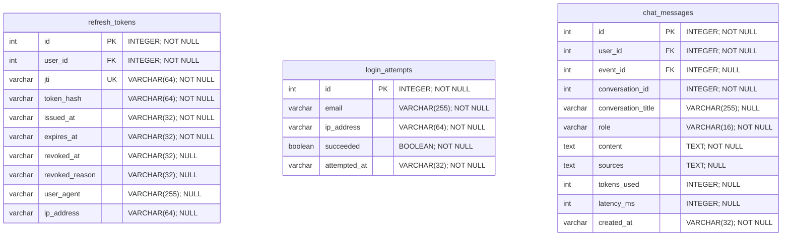

# ERD — Database v2 TeamBuilding Portal

> Đối chiếu trực tiếp SQLAlchemy `Base.metadata` trong `backend/app/models/`.
> Đây là schema v2 cho DB mới; không phải schema trong chuỗi migration v1.

**27 bảng · 334 cột · 56 ràng buộc khoá ngoại (gồm 2 FK ghép).**

## 1. Cách đọc sơ đồ

- `PK`: khoá chính; `FK`: khoá ngoại; `UK`: UNIQUE trên một cột.
- UNIQUE ghép và UNIQUE có điều kiện không đánh `UK` riêng từng cột; xem mục 5.
- `||`: đúng một; `|o` / `o|`: không hoặc một; `o{`: không hoặc nhiều.
- Đường `..` biểu diễn quan hệ không định danh: FK không nằm trong PK của bảng con.
- Cardinality lấy từ NULL/NOT NULL và UNIQUE của DB, không suy đoán theo nghiệp vụ.
- FK ghép được vẽ bằng **một đường**, nhãn liệt kê toàn bộ cột tham gia.
- Sơ đồ tổng quan chỉ hiện PK để bớt rối; mục 3 hiện đầy đủ mọi cột, kể cả timestamp.
- Sơ đồ chi tiết chỉ nối các bảng trong cùng nhóm; quan hệ xuyên nhóm nằm ở tổng quan và mục 4.
- Kiểu `varchar`, `text`, `json`, `boolean`, `int` là ký hiệu Mermaid; kiểu SQL và NULL nằm trong chú thích.
- Chuỗi thời gian giữ định dạng của models: ngày `YYYY-MM-DD`, giờ `HH:MM`, timestamp UTC ISO-8601.

## 2. Tổng quan đủ 27 bảng

`registrations` là trung tâm hành trình của một người trong một kỳ. Xếp phòng nằm trực tiếp trên đăng ký; xe nằm trên `registration_legs`; giữ/xác nhận ghế nằm trực tiếp trên `gala_seats`.

```mermaid
erDiagram
    audit_logs {
        int id PK "INTEGER; NOT NULL"
    }
    buses {
        int id PK "INTEGER; NOT NULL"
    }
    chat_messages {
        int id PK "INTEGER; NOT NULL"
    }
    contents {
        int id PK "INTEGER; NOT NULL"
    }
    departments {
        int id PK "INTEGER; NOT NULL"
    }
    email_logs {
        int id PK "INTEGER; NOT NULL"
    }
    events {
        int id PK "INTEGER; NOT NULL"
    }
    flight_assignments {
        int id PK "INTEGER; NOT NULL"
    }
    flights {
        int id PK "INTEGER; NOT NULL"
    }
    gala_draw_orders {
        int id PK "INTEGER; NOT NULL"
    }
    gala_layouts {
        int id PK "INTEGER; NOT NULL"
    }
    gala_seats {
        int id PK "INTEGER; NOT NULL"
    }
    gala_tables {
        int id PK "INTEGER; NOT NULL"
    }
    hotels {
        int id PK "INTEGER; NOT NULL"
    }
    itinerary_items {
        int id PK "INTEGER; NOT NULL"
    }
    login_attempts {
        int id PK "INTEGER; NOT NULL"
    }
    pickup_points {
        int id PK "INTEGER; NOT NULL"
    }
    refresh_tokens {
        int id PK "INTEGER; NOT NULL"
    }
    registration_cancellations {
        int id PK "INTEGER; NOT NULL"
    }
    registration_legs {
        int id PK "INTEGER; NOT NULL"
    }
    registrations {
        int id PK "INTEGER; NOT NULL"
    }
    rooms {
        int id PK "INTEGER; NOT NULL"
    }
    shifts {
        int id PK "INTEGER; NOT NULL"
    }
    teams {
        int id PK "INTEGER; NOT NULL"
    }
    trip_legs {
        int id PK "INTEGER; NOT NULL"
    }
    users {
        int id PK "INTEGER; NOT NULL"
    }
    work_locations {
        int id PK "INTEGER; NOT NULL"
    }

    users |o..o{ audit_logs : "actor_id"
    events |o..o{ audit_logs : "event_id"
    events ||..o{ buses : "event_id"
    users |o..o{ buses : "leader_user_id"
    flights |o..o{ buses : "linked_flight_id"
    pickup_points |o..o{ buses : "pickup_point_id"
    trip_legs ||..o{ buses : "trip_leg_id"
    events |o..o{ chat_messages : "event_id"
    users ||..o{ chat_messages : "user_id"
    users |o..o{ contents : "created_by"
    events |o..o{ contents : "event_id"
    events |o..o{ email_logs : "event_id"
    users |o..o{ email_logs : "user_id"
    users |o..o{ flight_assignments : "assigned_by"
    flights ||..o{ flight_assignments : "flight_id, direction"
    registrations ||..o{ flight_assignments : "registration_id"
    events ||..o{ flights : "event_id"
    shifts |o..o{ flights : "shift_id"
    gala_layouts ||..o{ gala_draw_orders : "layout_id"
    teams ||..o{ gala_draw_orders : "team_id"
    events ||..o| gala_layouts : "event_id"
    users |o..o{ gala_seats : "confirmed_by"
    users |o..o{ gala_seats : "held_by"
    registrations |o..o| gala_seats : "registration_id"
    gala_tables ||..o{ gala_seats : "table_id"
    teams |o..o{ gala_seats : "team_id"
    gala_layouts ||..o{ gala_tables : "layout_id"
    events ||..o{ hotels : "event_id"
    events ||..o{ itinerary_items : "event_id"
    trip_legs |o..o{ itinerary_items : "trip_leg_id"
    events ||..o{ pickup_points : "event_id"
    trip_legs |o..o{ pickup_points : "trip_leg_id"
    work_locations |o..o{ pickup_points : "work_location_id"
    users ||..o{ refresh_tokens : "user_id"
    users |o..o{ registration_cancellations : "decided_by"
    events ||..o{ registration_cancellations : "event_id"
    registrations ||..o{ registration_cancellations : "registration_id"
    users ||..o{ registration_cancellations : "user_id"
    users |o..o{ registration_legs : "assigned_by"
    buses |o..o{ registration_legs : "bus_id, trip_leg_id"
    pickup_points |o..o{ registration_legs : "pickup_point_id"
    registrations ||..o{ registration_legs : "registration_id"
    trip_legs ||..o{ registration_legs : "trip_leg_id"
    work_locations |o..o{ registrations : "departure_location_id"
    events ||..o{ registrations : "event_id"
    users |o..o{ registrations : "room_assigned_by"
    rooms |o..o{ registrations : "room_id"
    shifts |o..o{ registrations : "shift_id"
    users ||..o{ registrations : "user_id"
    hotels ||..o{ rooms : "hotel_id"
    events ||..o{ shifts : "event_id"
    departments |o..o{ teams : "department_id"
    events ||..o{ trip_legs : "event_id"
    departments |o..o{ users : "department_id"
    teams |o..o{ users : "team_id"
    work_locations |o..o{ users : "work_location_id"
```

### Danh sách bảng theo nhóm

| Nhóm | Số bảng | Bảng |
|---|---:|---|
| Nền tảng và nhân sự | 5 | `events`, `departments`, `work_locations`, `teams`, `users` |
| Đăng ký, huỷ và nhu cầu xe | 3 | `registrations`, `registration_cancellations`, `registration_legs` |
| Chuyến bay | 3 | `shifts`, `flights`, `flight_assignments` |
| Xe và điểm đón | 3 | `trip_legs`, `pickup_points`, `buses` |
| Khách sạn và phòng | 2 | `hotels`, `rooms` |
| Gala Dinner | 4 | `gala_layouts`, `gala_tables`, `gala_seats`, `gala_draw_orders` |
| Nội dung và vận hành | 4 | `itinerary_items`, `contents`, `email_logs`, `audit_logs` |
| Xác thực và chatbot | 3 | `refresh_tokens`, `login_attempts`, `chat_messages` |
| **Tổng** | **27** | Không có bảng archive hay bảng phụ giả lập model cũ |

## 3. ERD chi tiết theo nhóm

### 3.1. Nền tảng và nhân sự

### 3.2. Đăng ký, huỷ và nhu cầu xe

### 3.3. Chuyến bay

### 3.4. Xe và điểm đón

### 3.5. Khách sạn và phòng

### 3.6. Gala Dinner

### 3.7. Nội dung và vận hành

### 3.8. Xác thực và chatbot

## 4. Danh sách đầy đủ khoá ngoại

Mỗi dòng là một constraint thực tế. `NO ACTION` là mặc định khi model không khai báo `ondelete`; không đồng nhất hành vi FK với cascade của ORM.

| # | Bảng con / cột | Bảng cha / cột | Khi xoá cha |
|---:|---|---|---|
| 1 | `audit_logs(actor_id)` | `users(id)` | `NO ACTION` |
| 2 | `audit_logs(event_id)` | `events(id)` | `CASCADE` |
| 3 | `buses(event_id)` | `events(id)` | `CASCADE` |
| 4 | `buses(leader_user_id)` | `users(id)` | `NO ACTION` |
| 5 | `buses(linked_flight_id)` | `flights(id)` | `NO ACTION` |
| 6 | `buses(pickup_point_id)` | `pickup_points(id)` | `NO ACTION` |
| 7 | `buses(trip_leg_id)` | `trip_legs(id)` | `NO ACTION` |
| 8 | `chat_messages(event_id)` | `events(id)` | `CASCADE` |
| 9 | `chat_messages(user_id)` | `users(id)` | `NO ACTION` |
| 10 | `contents(created_by)` | `users(id)` | `NO ACTION` |
| 11 | `contents(event_id)` | `events(id)` | `CASCADE` |
| 12 | `email_logs(event_id)` | `events(id)` | `NO ACTION` |
| 13 | `email_logs(user_id)` | `users(id)` | `NO ACTION` |
| 14 | `flight_assignments(assigned_by)` | `users(id)` | `NO ACTION` |
| 15 | `flight_assignments(flight_id, direction)` | `flights(id, direction)` | `NO ACTION` |
| 16 | `flight_assignments(registration_id)` | `registrations(id)` | `CASCADE` |
| 17 | `flights(event_id)` | `events(id)` | `CASCADE` |
| 18 | `flights(shift_id)` | `shifts(id)` | `NO ACTION` |
| 19 | `gala_draw_orders(layout_id)` | `gala_layouts(id)` | `CASCADE` |
| 20 | `gala_draw_orders(team_id)` | `teams(id)` | `NO ACTION` |
| 21 | `gala_layouts(event_id)` | `events(id)` | `CASCADE` |
| 22 | `gala_seats(confirmed_by)` | `users(id)` | `NO ACTION` |
| 23 | `gala_seats(held_by)` | `users(id)` | `NO ACTION` |
| 24 | `gala_seats(registration_id)` | `registrations(id)` | `NO ACTION` |
| 25 | `gala_seats(table_id)` | `gala_tables(id)` | `CASCADE` |
| 26 | `gala_seats(team_id)` | `teams(id)` | `NO ACTION` |
| 27 | `gala_tables(layout_id)` | `gala_layouts(id)` | `CASCADE` |
| 28 | `hotels(event_id)` | `events(id)` | `CASCADE` |
| 29 | `itinerary_items(event_id)` | `events(id)` | `CASCADE` |
| 30 | `itinerary_items(trip_leg_id)` | `trip_legs(id)` | `SET NULL` |
| 31 | `pickup_points(event_id)` | `events(id)` | `CASCADE` |
| 32 | `pickup_points(trip_leg_id)` | `trip_legs(id)` | `NO ACTION` |
| 33 | `pickup_points(work_location_id)` | `work_locations(id)` | `NO ACTION` |
| 34 | `refresh_tokens(user_id)` | `users(id)` | `CASCADE` |
| 35 | `registration_cancellations(decided_by)` | `users(id)` | `NO ACTION` |
| 36 | `registration_cancellations(event_id)` | `events(id)` | `CASCADE` |
| 37 | `registration_cancellations(registration_id)` | `registrations(id)` | `CASCADE` |
| 38 | `registration_cancellations(user_id)` | `users(id)` | `NO ACTION` |
| 39 | `registration_legs(assigned_by)` | `users(id)` | `NO ACTION` |
| 40 | `registration_legs(bus_id, trip_leg_id)` | `buses(id, trip_leg_id)` | `NO ACTION` |
| 41 | `registration_legs(pickup_point_id)` | `pickup_points(id)` | `NO ACTION` |
| 42 | `registration_legs(registration_id)` | `registrations(id)` | `CASCADE` |
| 43 | `registration_legs(trip_leg_id)` | `trip_legs(id)` | `NO ACTION` |
| 44 | `registrations(departure_location_id)` | `work_locations(id)` | `NO ACTION` |
| 45 | `registrations(event_id)` | `events(id)` | `CASCADE` |
| 46 | `registrations(room_assigned_by)` | `users(id)` | `NO ACTION` |
| 47 | `registrations(room_id)` | `rooms(id)` | `NO ACTION` |
| 48 | `registrations(shift_id)` | `shifts(id)` | `NO ACTION` |
| 49 | `registrations(user_id)` | `users(id)` | `NO ACTION` |
| 50 | `rooms(hotel_id)` | `hotels(id)` | `CASCADE` |
| 51 | `shifts(event_id)` | `events(id)` | `CASCADE` |
| 52 | `teams(department_id)` | `departments(id)` | `NO ACTION` |
| 53 | `trip_legs(event_id)` | `events(id)` | `CASCADE` |
| 54 | `users(department_id)` | `departments(id)` | `NO ACTION` |
| 55 | `users(team_id)` | `teams(id)` | `NO ACTION` |
| 56 | `users(work_location_id)` | `work_locations(id)` | `NO ACTION` |

## 5. UNIQUE và CHECK trong schema

Khoá chính `id` của mỗi bảng đã được thể hiện trên sơ đồ; dưới đây là các UNIQUE bổ sung và CHECK thực tế, không bao gồm quy tắc chỉ kiểm tra ở service.

### 5.1. UNIQUE / unique index

| Bảng | Cột | Điều kiện / ghi chú |
|---|---|---|
| `buses` | `(event_id, trip_leg_id, bus_code)` | Toàn bảng; `uq_buses_event_leg_code` |
| `buses` | `(id, trip_leg_id)` | Toàn bảng; `uq_buses_id_leg` |
| `departments` | `(code)` | Toàn bảng; `uq_departments_code` |
| `events` | `(code)` | Toàn bảng; `uq_events_code` |
| `flight_assignments` | `(registration_id, direction)` | Toàn bảng; `uq_flight_assignments_registration_direction` |
| `flights` | `(event_id, flight_code, direction)` | Toàn bảng; `uq_flights_event_code_direction` |
| `flights` | `(id, direction)` | Toàn bảng; `uq_flights_id_direction` |
| `gala_draw_orders` | `(layout_id, draw_position)` | Toàn bảng; `uq_gala_draw_layout_position` |
| `gala_draw_orders` | `(layout_id, team_id)` | Toàn bảng; `uq_gala_draw_layout_team` |
| `gala_layouts` | `(event_id)` | Toàn bảng; `uq_gala_layouts_event` |
| `gala_seats` | `(registration_id)` | Toàn bảng; `uq_gala_seats_registration` |
| `gala_seats` | `(table_id, seat_number)` | Toàn bảng; `uq_gala_seats_table_number` |
| `gala_tables` | `(layout_id, table_code)` | Toàn bảng; `uq_gala_tables_layout_code` |
| `refresh_tokens` | `(jti)` | Toàn bảng; `ix_refresh_tokens_jti` |
| `registration_cancellations` | `(registration_id)` | WHERE `status = 'pending'`; `uq_registration_cancellations_pending` |
| `registration_legs` | `(registration_id, trip_leg_id)` | Toàn bảng; `uq_registration_legs_registration_leg` |
| `registrations` | `(event_id, user_id)` | Toàn bảng; `uq_registrations_event_user` |
| `rooms` | `(hotel_id, room_number)` | Toàn bảng; `uq_rooms_hotel_number` |
| `shifts` | `(event_id, code)` | Toàn bảng; `uq_shifts_event_code` |
| `teams` | `(code)` | Toàn bảng; `uq_teams_code` |
| `trip_legs` | `(event_id, code)` | Toàn bảng; `uq_trip_legs_event_code` |
| `users` | `(email)` | Toàn bảng; `ix_users_email` |
| `users` | `(employee_code)` | Toàn bảng; `ix_users_employee_code` |
| `users` | `(sso_subject)` | Toàn bảng; `uq_users_sso_subject` |
| `work_locations` | `(code)` | Toàn bảng; `uq_work_locations_code` |

### 5.2. CHECK

| Bảng | Constraint | Biểu thức SQL |
|---|---|---|
| `buses` | `ck_buses_capacity_positive` | `capacity > 0` |
| `chat_messages` | `ck_chat_messages_role_valid` | `role IN ('user', 'assistant')` |
| `contents` | `ck_contents_announcement_has_event` | `kind != 'announcement' OR event_id IS NOT NULL` |
| `contents` | `ck_contents_doc_type_valid` | `doc_type IS NULL OR doc_type IN ('terms', 'faq', 'guide', 'itinerary')` |
| `contents` | `ck_contents_document_has_type` | `kind != 'document' OR doc_type IS NOT NULL` |
| `contents` | `ck_contents_kind_valid` | `kind IN ('announcement', 'document')` |
| `contents` | `ck_contents_severity_valid` | `severity IN ('info', 'warning', 'urgent')` |
| `contents` | `ck_contents_target_valid` | `target_type IN ('all', 'team', 'flight', 'bus', 'user')` |
| `email_logs` | `ck_email_logs_status_valid` | `status IN ('queued', 'sent', 'failed')` |
| `events` | `ck_events_status_valid` | `status IN ('draft', 'registration_open', 'registration_closed', 'allocation_processing', 'information_published', 'event_started', 'completed')` |
| `flight_assignments` | `ck_flight_assignments_direction_valid` | `direction IN ('outbound', 'return')` |
| `flight_assignments` | `ck_flight_assignments_mode_valid` | `assignment_mode IN ('auto', 'manual')` |
| `flights` | `ck_flights_capacity_non_negative` | `capacity >= 0` |
| `flights` | `ck_flights_direction_valid` | `direction IN ('outbound', 'return')` |
| `flights` | `ck_flights_reserved_non_negative` | `reserved_slots >= 0` |
| `flights` | `ck_flights_reserved_within_capacity` | `reserved_slots <= capacity` |
| `gala_draw_orders` | `ck_gala_draw_orders_quota_non_negative` | `quota >= 0` |
| `gala_draw_orders` | `ck_gala_draw_orders_status_valid` | `status IN ('waiting', 'active', 'done', 'skipped')` |
| `gala_layouts` | `ck_gala_layouts_hold_seconds_positive` | `hold_seconds > 0` |
| `gala_layouts` | `ck_gala_layouts_selection_status_valid` | `selection_status IN ('closed', 'drawing', 'open', 'finalized')` |
| `gala_seats` | `ck_gala_seats_state_consistent` | `(status = 'free' AND team_id IS NULL AND registration_id IS NULL AND held_by IS NULL AND hold_expires_at IS NULL AND confirmed_by IS NULL AND confirmed_at IS NULL) OR (status = 'held' AND team_id IS NOT NULL AND held_by IS NOT NULL AND hold_expires_at IS NOT NULL AND registration_id IS NULL AND confirmed_by IS NULL AND confirmed_at IS NULL) OR (status = 'taken' AND held_by IS NULL AND hold_expires_at IS NULL AND confirmed_by IS NOT NULL AND confirmed_at IS NOT NULL)` |
| `gala_seats` | `ck_gala_seats_status_valid` | `status IN ('free', 'held', 'taken')` |
| `gala_tables` | `ck_gala_tables_seat_count_positive` | `seat_count > 0` |
| `registration_cancellations` | `ck_registration_cancellations_mode_valid` | `mode IN ('self', 'request', 'admin')` |
| `registration_cancellations` | `ck_registration_cancellations_status_valid` | `status IN ('pending', 'approved', 'rejected', 'withdrawn')` |
| `registration_legs` | `ck_registration_legs_assigned_needs_bus` | `bus_id IS NULL OR needs_bus = 1` |
| `registration_legs` | `ck_registration_legs_mode_valid` | `assignment_mode IS NULL OR assignment_mode IN ('auto', 'manual')` |
| `registrations` | `ck_registrations_captain_has_room` | `room_id IS NOT NULL OR is_room_captain = 0` |
| `registrations` | `ck_registrations_companion_non_negative` | `companion_count >= 0` |
| `registrations` | `ck_registrations_consent_complete` | `(consent_version IS NULL AND consented_at IS NULL) OR (consent_version IS NOT NULL AND consented_at IS NOT NULL)` |
| `registrations` | `ck_registrations_room_mode_valid` | `room_mode IS NULL OR room_mode IN ('auto', 'manual')` |
| `registrations` | `ck_registrations_status_valid` | `status IN ('draft', 'submitted', 'cancelled')` |
| `rooms` | `ck_rooms_capacity_positive` | `capacity > 0` |
| `rooms` | `ck_rooms_gender_policy_valid` | `gender_policy IN ('any', 'male', 'female')` |
| `trip_legs` | `ck_trip_legs_direction_valid` | `direction IN ('outbound', 'return')` |
| `users` | `ck_users_gender_valid` | `gender IS NULL OR gender IN ('male', 'female', 'other')` |
| `users` | `ck_users_role_valid` | `role IN ('employee', 'team_leader', 'admin', 'super_admin')` |

## 6. Ghi chú quan trọng của thiết kế v2

### Những bảng đã gộp

| Bảng v1 | Vị trí trong v2 |
|---|---|
| `event_settings` | `events.settings` JSON, không thêm bảng |
| `consents` | `registrations.consent_version`, `consented_at`, `consent_ip`, `consent_user_agent`; lịch sử ở `audit_logs` với action `consent.agreed` |
| `room_assignments` | `registrations.room_id`, `is_room_captain`, `room_mode`, `room_assigned_by`, `room_assigned_at`, `room_note` |
| `registration_bus_needs` + `bus_assignments` | `registration_legs`; `bus_id IS NULL` nghĩa là chưa xếp xe |
| `gala_seat_holds` + `gala_seat_assignments` | `gala_seats.status`, `team_id`, `registration_id`, `held_by`, `held_at`, `hold_expires_at`, `confirmed_by`, `confirmed_at` |
| `chat_sessions` | `chat_messages.user_id`, `event_id`, `conversation_id`, `conversation_title` |
| `announcements` + `policy_documents` | `contents.kind`: `announcement` hoặc `document` |

### Ràng buộc và giới hạn cần hiểu đúng

- `flight_assignments(flight_id, direction) → flights(id, direction)`: không gán nhầm chiều chuyến bay.
- `registration_legs(bus_id, trip_leg_id) → buses(id, trip_leg_id)`: xe phải đúng chặng; FK đơn `trip_leg_id → trip_legs.id` vẫn kiểm tra chặng khi chưa có xe.
- `gala_layouts.event_id` UNIQUE: một kỳ có tối đa một layout.
- `gala_seats.registration_id` UNIQUE và nullable: một đăng ký có tối đa một ghế, nhưng nhiều ghế được phép chưa có người; `team_id` có thể NULL cho người không thuộc team.
- `gala_seats.status`: `free` / `held` / `taken`; CHECK ràng buộc các cột phù hợp với trạng thái.
- `gala_draw_orders.quota` là snapshot lúc bốc thăm; quota hiện tại phải đếm lại từ người đang tham gia.
- `registrations.cancelled_at`, `cancel_reason`, `penalty_applied` không phải cột DB v2; thông tin huỷ nằm ở `registration_cancellations`.
- `contents.event_id` NULL dành cho tài liệu dùng chung; thông báo bắt buộc gắn kỳ. Tài liệu bắt buộc có `doc_type`; `published_at` NULL có thể biểu diễn thông báo nháp.
- `chat_messages.conversation_id` là mã nhóm hội thoại, **không có FK tới bảng sessions**.
- `teams.leader_user_id` là tham chiếu mềm tới user, **không có FK thật** trong models hiện tại; vì vậy không vẽ thêm đường FK. `contents.target_id`, `email_logs.related_id`, `audit_logs.entity_id` cũng là tham chiếu mềm theo loại đối tượng.
- `login_attempts` độc lập: email chưa tồn tại vẫn được ghi nhận để chống dò tài khoản.
- Sức chứa, không trộn giới, cùng kỳ giữa các đối tượng và các quyền thao tác vẫn cần service kiểm tra; sơ đồ không khẳng định những quy tắc chưa có constraint DB.

## 7. Xem sơ đồ

Mở Markdown Preview có hỗ trợ Mermaid trong VS Code hoặc xem file trên GitHub. Nếu preview không render Mermaid, có thể dán riêng nội dung một khối `mermaid` vào [Mermaid Live Editor](https://mermaid.live/).

> Khi models thay đổi, cần đối chiếu/cập nhật lại file này; không dùng script ERD v1 để ghi đè vì danh sách nhóm bảng trong script cũ chưa theo v2.
